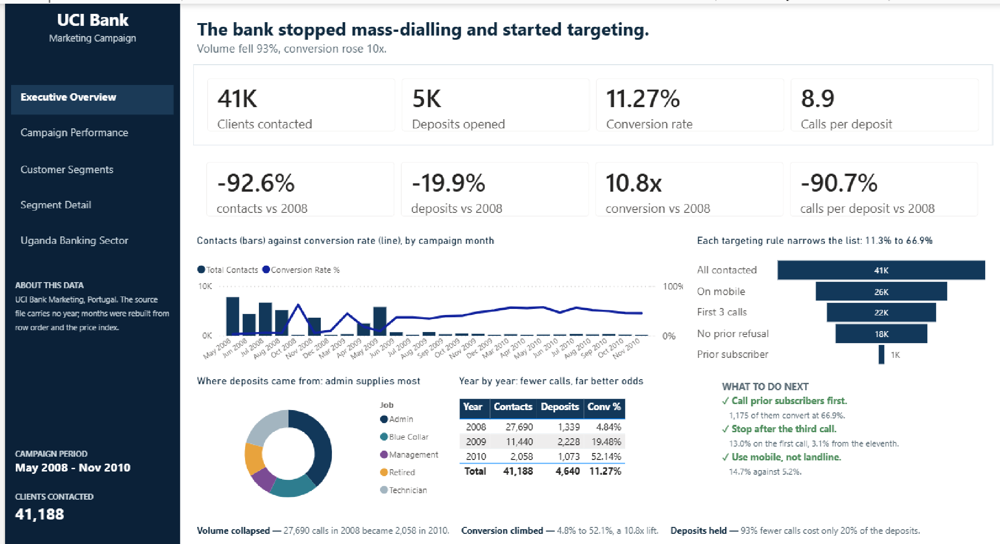
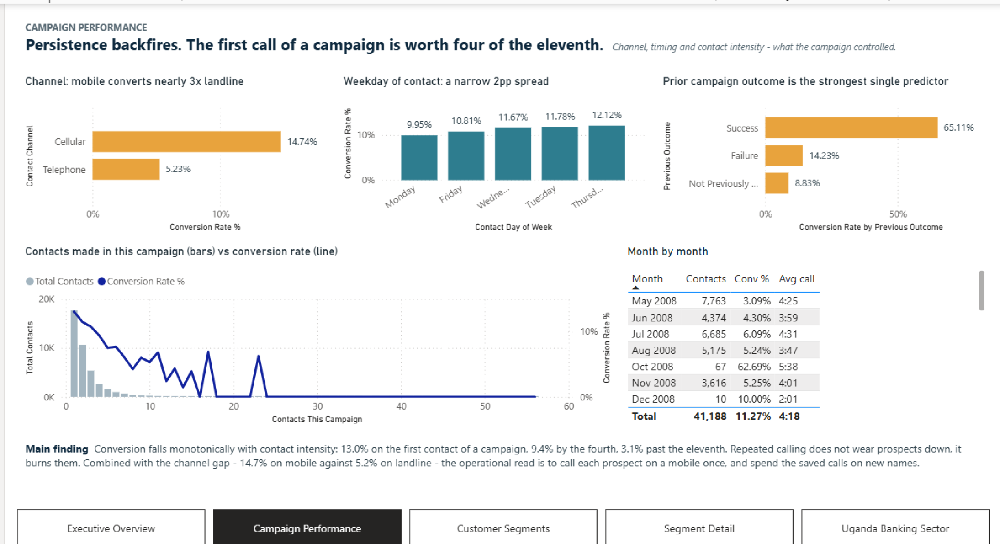
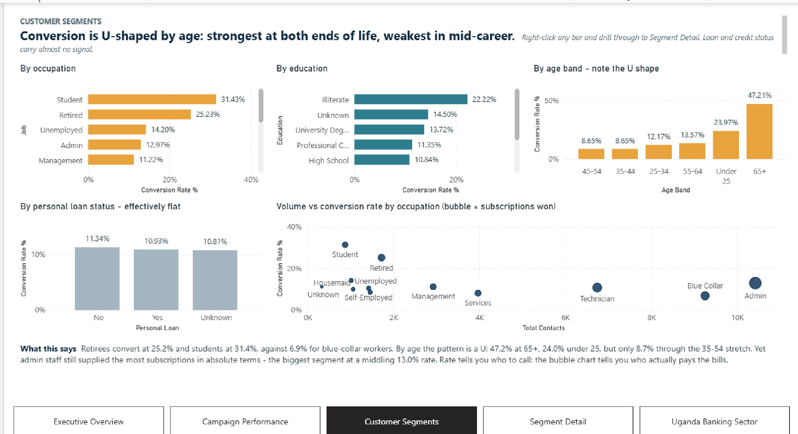
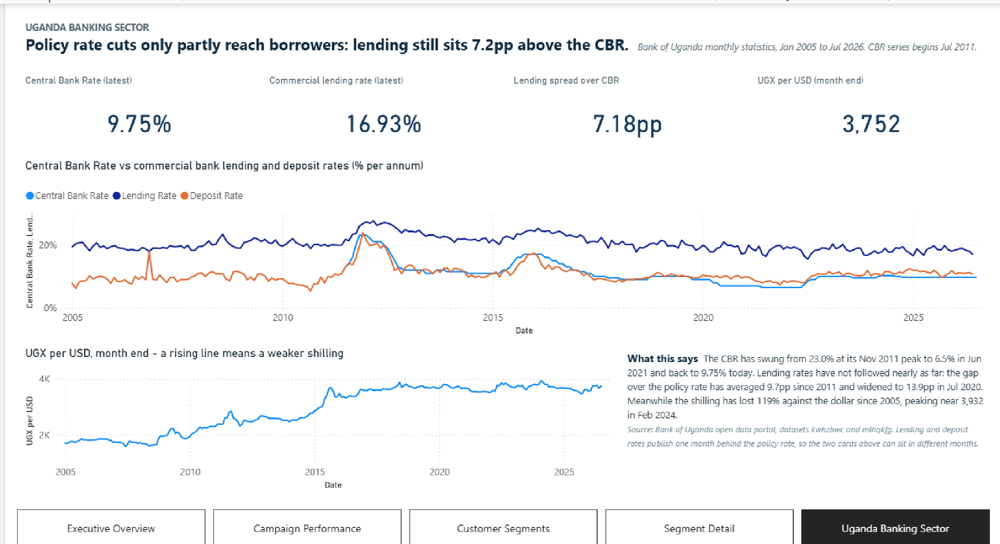

# Report pages

Five pages, 1280 × 720, on a shared theme
(`Bank Marketing.Report/StaticResources/RegisteredResources/BankMarketingTheme.json`).
Every visual carries alt text; every page carries navigation.

---

## 1. Executive Overview

The one-screen answer, laid out as a three-tier pyramid: headline figures, then
what changed over time, then what to do about it.

- **Left rail** — brand, page navigation, data provenance, campaign period.
- **KPI band** — four headline figures, each with its change from the first
  campaign year to the last. These use **pinned** measures, so clicking a bar or a
  table row cannot silently rewrite the headline.
- **Contacts vs conversion by month** — the strategy shift as it happened.
- **Targeting funnel** — cumulative targeting rules, 11.3% → 66.9%.
- **Where deposits came from** — share of deposits by occupation. Deliberately
  *share*, not rate: rates do not sum to a whole, so a donut of rates would be
  meaningless. It also surfaces the split between best rate and biggest source.
- **Year by year** and **What to do next** — the numbers, then the actions.

## 2. Campaign Performance

What the campaign actually controlled: channel, timing and contact intensity.

- Channel: mobile 14.7% against landline 5.2%.
- Weekday of contact: a narrow 2pp spread — timing barely matters.
- Prior campaign outcome: the strongest single predictor, 65.1% after a prior success.
- Contact intensity: conversion decays monotonically with the number of calls.
- Month-by-month table with contacts, conversion and average call length.

## 3. Customer Segments

Who converts, and who actually pays the bills.

- By occupation, education and age band — conversion is **U-shaped by age**,
  strongest at both ends of life.
- By personal loan status: effectively flat, which is itself a finding — loan and
  credit status carry almost no signal.
- Volume vs conversion scatter, bubble sized by deposits won: students and retirees
  sit high and left (great rate, small volume) while admin staff sit low and right
  (middling rate, most deposits).

Right-click any bar to drill through to Segment Detail.

## 4. Segment Detail *(drill-through target, hidden)*

Reached by right-clicking a segment on Customer Segments. Filters pass on Job,
Education and Age Band. The page header names the segment in view, and figures are
stated against the 11.27% campaign baseline in percentage points.

Not shown here because it is meaningless without a drill-through context.

## 5. Uganda Banking Sector

Macro context, on its own disconnected calendar — unrelated to the Portuguese
campaign, and the page says so.

- Latest policy rate, commercial lending rate, lending spread and exchange rate.
- Central Bank Rate against commercial lending and deposit rates since 2005.
- UGX per USD, month end.

Two honesty notes are stated on the page itself: the CBR series begins July 2011,
when Uganda adopted the rate, and lending and deposit rates publish a month behind
the policy rate, so the "latest" cards can legitimately sit in different months.

---

## Conventions

- **Insight titles.** Every visual title states the finding, not the topic —
  "Channel: mobile converts nearly 3x landline", not "Conversion by channel".
- **Data-visual budget.** No page exceeds 8 query-generating visuals. Textboxes and
  navigation are chrome and cost no query; `tools/validate_pbip.py` counts them
  separately.
- **Alt text** on all visuals, chrome included.
- **Navigation** on every page. The Executive Overview uses a rail of buttons; the
  other pages use a horizontal navigator at the same position.
